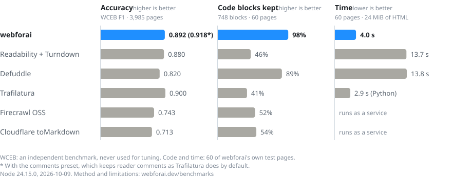

<br/>

<p align="center">
  <a href="https://webforai.dev">
    <picture>
      <source media="(prefers-color-scheme: dark)" srcset="https://webforai.dev/images/logo-full-dark.svg">
      
    </picture>
  </a>
</p>

<h3 align="center">Any web page, as clean Markdown for LLMs.</h3>

<p align="center">
  Main content only — no navigation, ads or cookie banners. The highest WCEB score of the
  open-source extractors we tested, about 3× faster than Readability + Turndown, and small enough
  to run in a Cloudflare Worker or a browser.
</p>

<p align="center">
  <a href="https://www.npmjs.com/package/webforai"></a>
  <a href="https://www.npmjs.com/package/webforai"></a>
  <a href="https://github.com/inaridiy/webforai/actions/workflows/ci.yaml"></a>
  <a href="https://github.com/inaridiy/webforai/blob/main/LICENSE"></a>
</p>

<p align="center">
  <a href="https://webforai.dev/getting-started"><b>Docs</b></a> ·
  <a href="https://webforai.dev/benchmarks"><b>Benchmarks</b></a> ·
  <a href="https://webforai.dev/cli"><b>CLI</b></a> ·
  <a href="https://platform.webforai.dev"><b>Hosted API</b></a>
</p>

<br/>

```bash
npx webforai-cli https://example.com/article
```

```ts
import { htmlToMarkdown } from "webforai";

const markdown = htmlToMarkdown(html, { url });
```

## Benchmarks

<picture>
  <source media="(prefers-color-scheme: dark)" srcset="site/docs/public/images/benchmark-dark.svg">
  
</picture>

[WCEB](https://github.com/chatnoir-eu/web-content-extraction-benchmark) (Bevendorff et al., SIGIR 2023)
scores extracted text against reference text on 3,985 pages; webforai is never tuned on it. Code
blocks and time come from 60 cached real pages that webforai is developed against, so those
likely favour it. Not everything goes webforai's way: Defuddle keeps more data tables (55% to
39%), mostly Wikipedia navigation boxes that webforai drops on purpose. The method, each
pipeline's configuration, Firecrawl and the limitations are on the
[benchmarks page](https://webforai.dev/benchmarks); everything is reproducible from [`evals/`](evals).

<details>
<summary>All numbers</summary>

|  | webforai | Readability + Turndown | Defuddle |
| --- | ---: | ---: | ---: |
| **WCEB F1** — 3,985 pages, reference text | **0.892** | 0.880 | 0.820 |
| Precision / recall | **0.922 / 0.909** | 0.917 / 0.892 | 0.869 / 0.856 |
| Code blocks kept as code — 748 blocks | **98.0%** | 45.9% | 89.2% |
| Data tables kept — 64 tables | 39.1% | 29.7% | **54.7%** |
| Quality checks passed | **74 / 74** | 63 / 74 | 72 / 74 |
| Time to convert 60 pages (24 MiB) | **3.7 s** | 11.5 s | 12.7 s |

</details>

## Why webforai

- **Main content, found by a model.** Pages go through site adapters first, then **kiwame**, a
  small learned block classifier written in plain TypeScript: no WASM, no native code, no network
  calls. [How it works →](https://webforai.dev/how-it-works)
- **Twenty site adapters.** GitHub, Stack Overflow, npm, MDN, Wikipedia, Reddit, YouTube,
  Hacker News, Medium, Substack, Zenn, Qiita, note, Hatena, WordPress, Docusaurus, VitePress,
  MkDocs, Read the Docs and GitBook. They match by hostname or by platform fingerprint, so
  self-hosted instances are covered, and fall back to generic extraction when a site changes.
- **Markup that survives.** Code blocks keep their language, including tabbed and
  Twoslash-annotated code. Tables stay GFM tables, KaTeX and MathJax become LaTeX, and
  lazy-loaded images, definition lists and sub/superscripts come through.
- **Built for agents.** `agentExtractor` appends the page's other links, grouped by role
  (related, pagination, section navigation, breadcrumbs), so an agent knows where to go next.
  Metadata comes back as data or YAML front matter.
- **Easy to embed.** About 100 packages and 14 MB installed, with no browser driver and no Node.js
  built-ins. It runs in Node.js (ESM and CommonJS), Cloudflare Workers (no `nodejs_compat`)
  and browsers. [Embedding in your project →](https://webforai.dev/embedding)

## Three ways to use it

| | Install | Use it for |
| --- | --- | --- |
| **Library** — [`webforai`](https://www.npmjs.com/package/webforai) | `npm i webforai` | HTML you already have, in your own code. [Getting started →](https://webforai.dev/getting-started) |
| **CLI** — [`webforai-cli`](https://www.npmjs.com/package/webforai-cli) | `npx webforai-cli <url>` | The shell, scripts and AI agents (it ships an Agent Skill). [CLI →](https://webforai.dev/cli) |
| **Hosted API** — [webforai platform](https://platform.webforai.dev) | API key | JavaScript rendering, proxies, and crawling whole sites to Markdown and `llms.txt`. 1,000 free credits a month. [Platform docs →](https://webforai.dev/platform) |

The library fetches nothing by itself. Pass it HTML, or load pages with
`webforai/loaders/fetch`, `webforai/loaders/playwright` (add `playwright-core`) or the
[other loaders](https://webforai.dev/docs/loaders):

```ts
import { htmlToMarkdownWithMetadata } from "webforai";
import { loadHtml } from "webforai/loaders/fetch";

const url = "https://example.com/article";
const { markdown, metadata } = htmlToMarkdownWithMetadata(await loadHtml(url), { url, baseUrl: url });
// metadata: { title, author, published, siteName, canonicalUrl, lang, ... }
```

Everything lives in this repository: the library in [`packages/webforai`](packages/webforai), the
CLI in [`packages/cli`](packages/cli) (up to v4 it shipped inside `webforai` as `npx webforai`),
and the hosted platform in [`apps/platform`](apps/platform), which you can
[run yourself](https://github.com/inaridiy/webforai/tree/main/apps/platform#deploying-your-own-instance).
Release notes are in the [CHANGELOG](packages/webforai/CHANGELOG.md).

## Contributing

See [AGENTS.md](AGENTS.md) for the toolchain (`pnpm install`, `pnpm test --run`, `pnpm build`)
and for where things live.

## Support

- [GitHub Sponsors](https://github.com/sponsors/inaridiy)
- [@inaridiy on X](https://x.com/inaridiy)

## License

[Apache 2.0](LICENSE)
